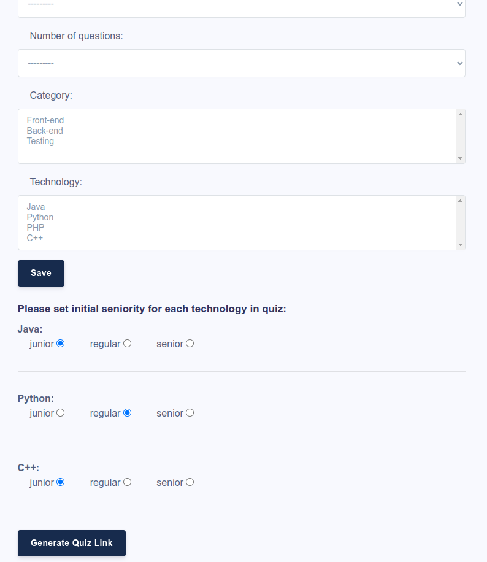

# skillstrainer (python 3.10)

Application useful either for recruiters or people simply trying to improve their qualifications. By default application generates quiz in the selected IT category/technology, with selected number of questions and seniority (most of the questions in the attached sqlite base are placeholders of course, but fully cappable of running locally).  

Main features:
* two modes: 
  * training (displays technology and seniority of current question, as well as correct answers, as a form of instant feedback)
  * recruitment (displays only running time)
      
 * dynamic change of seniority level (if user reaches certain percentage of correct/incorrect answers, application will upgrade or downgrade seniority 
   of incoming questions on the spot)
   
 * several question types (it is possible to implement different types of questions: multichoice, open, true/false or using snippets of code/pictures as 
   options)
   
 * graphical representation of the results (in training mode besides instant feedback during quiz, application will also show results in a form of charts)
 
 * browser buttons assurance (if user tries to use browser buttons to cheat e.g. load previously answered question, application will draw the next one 
   and count current question as ommited - but still counting in final result summary)
